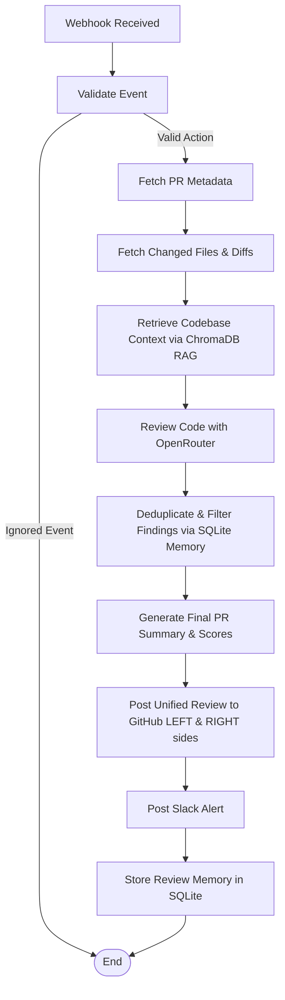

# 🤖 AI-Powered GitHub Pull Request Reviewer

A production-grade, agentic code review assistant built using **FastAPI**, **LangGraph**, **OpenRouter (DeepSeek V3 / Gemini)**, local **SentenceTransformers (RAG)**, **ChromaDB**, and **GitHub REST & Webhooks APIs**.

This system automatically reviews GitHub pull requests upon creation or updates. It performs security, performance, maintainability, and coding standards validation. By utilizing Retrieval-Augmented Generation (RAG) over the repository codebase using local vector embeddings, it ensures that AI recommendations align with your project's established conventions (e.g. suggesting your custom loggers over raw `print` statements).

---

## 🏗️ Architecture & Data Flow

### Workflow State Machine (LangGraph)
The review pipeline is modeled as an advanced state graph using **LangGraph**, enabling graceful error fallback, skips, and complex data routing:



### Sequence Flow
Below is the system communication sequence:

```mermaid
sequenceDiagram
    autonumber
    actor Developer
    participant GitHub
    participant FastAPI App
    participant ChromaDB (Local RAG)
    participant OpenRouter API
    participant Slack

    Developer->>GitHub: Open / Update Pull Request
    GitHub->>FastAPI App: POST Webhook (Event: pull_request)
    Note over FastAPI App: Validates Signature & Schedules Background Review Task
    FastAPI App-->>GitHub: Response 200 OK (Accepted)
    
    rect rgb(30, 30, 40)
        Note over FastAPI App: Async Review Process (LangGraph)
        FastAPI App->>GitHub: Fetch PR metadata & changed file diffs
        GitHub-->>FastAPI App: Returns files, diff patches & metadata
        FastAPI App->>ChromaDB (Local RAG): Query similar code patterns (SentenceTransformer)
        ChromaDB (Local RAG)-->>FastAPI App: Returns local code references & conventions
        FastAPI App->>OpenRouter API: Run reviews with Structured JSON output
        OpenRouter API-->>FastAPI App: returns structured line-by-line issues
        FastAPI App->>OpenRouter API: Request PR summary review & scoring
        OpenRouter API-->>FastAPI App: returns markdown summary & scores
        FastAPI App->>GitHub: POST Review comments (LEFT/RIGHT sides) & summary block
        FastAPI App->>Slack: POST summary notification (Webhook)
        FastAPI App->>FastAPI App: Save run stats & feedback to SQLite database
    end
```



---

## 🌟 Core Features

1. **OpenRouter Integration**: Configured to run on top-tier open models like `deepseek/deepseek-chat-v3` or Gemini via OpenRouter.
2. **Local, High-Performance RAG**: Indexes repository files into ChromaDB using a CPU-friendly local embedding model (`sentence-transformers/all-MiniLM-L6-v2`). Runs entirely offline without using API key quotas.
3. **Dual-Side Diff Commenting**: Analyzes unified Git patches to place comments on the correct side of the diff. Correctly targets additions/modifications on the `RIGHT` side, and deleted code/files on the `LEFT` side.
4. **Draft Review Batching**: Submits all line comments and the summary report as a single atomic GitHub Review, preventing API rate-limiting and developer email spam.
5. **Self-Correcting Developer Feedback Memory**: Hooks into comment webhook threads. When developers accept, reject, or dispute review comments, it registers their sentiment in the SQLite database and automatically suppresses/downgrades matching findings in future reviews.
6. **Docker Storage Optimization**: Docker image uses CPU-only PyTorch packages (`--index-url https://download.pytorch.org/whl/cpu`) reducing container footprint by **1.5 GB+**. Hugging Face models are cached in a persistent volume directory (`./data/huggingface`) to prevent re-downloads.
7. **Interactive Dashboard & Analytics**: Embedded HTML/CSS landing page serving system stats, setup configurations, and SQLite-backed review historical runs.

---

## ⚙️ Project Structure

```text
app/
├── api/
│   ├── webhooks.py         # Webhook signature validation & background router
│   └── dashboard.py        # Analytics metrics & index trigger endpoints
├── config/
│   └── settings.py         # Configuration settings loadable from .env
├── db/
│   └── session.py          # SQLite database connection session
├── github/
│   └── client.py           # Async HTTP Client for GitHub REST APIs
├── models/
│   ├── database.py         # SQLite tables (logs, findings, developer feedback)
│   └── schemas.py          # Pydantic schemas (validations, structured AI outputs)
├── prompts/
│   ├── review_prompts.py   # Code review guidelines (Security, Perf, Maintainability)
│   └── summary_prompts.py  # Report format & scores prompts
├── rag/
│   ├── indexer.py          # Code file chunking & ChromaDB indexing
│   └── retriever.py        # Semantic similarity convention searcher
├── services/
│   ├── analytics_service.py # Database aggregators & sentiment classifiers
│   ├── gemini_service.py   # OpenRouter client wrappers & JSON parses
│   ├── github_service.py   # Diff mapping & dual-side comment placing
│   └── slack_service.py    # Formatting & posting Slack block messages
└── main.py                 # FastAPI application root & landing page HTML
tests/                      # pytest suites
```

---

## 🚀 Setup & Installation

### Prerequisites
- Python 3.12+
- Git
- OpenRouter API Key
- GitHub Personal Access Token (PAT) with `repo` scope

### 1. Local Setup
1. Clone the project and navigate to the folder:
   ```bash
   cd github-pr-reviewer
   ```
2. Create and activate a virtual environment:
   ```bash
   python -m venv venv
   # On Windows:
   .\venv\Scripts\Activate.ps1
   # On Linux/macOS:
   source venv/bin/activate
   ```
3. Install dependencies:
   ```bash
   pip install -r requirements.txt
   ```
4. Create a `.env` file from the example:
   ```bash
   copy .env.example .env
   ```
5. Update `.env` variables with your credentials (API keys, GitHub tokens, webhook secret).

### 2. Running the Server Locally
Launch the FastAPI server with Uvicorn:
```bash
uvicorn app.main:app --reload --host 0.0.0.0 --port 8000
```
Visit `http://localhost:8000` to view the landing page and `http://localhost:8000/docs` for API Swagger docs.

### 3. Exposing Webhooks via Ngrok
To receive GitHub webhooks locally:
```bash
ngrok http 8000
```
Copy the forwarding HTTPS URL (e.g. `https://xxxx-xxxx.ngrok-free.app`) and append `/api/v1/webhooks/github` as your payload URL in GitHub repository settings.

### 4. Indexing Your Codebase for RAG
To initialize the RAG vector store for your repository:
```bash
python run_indexer.py
```
Or trigger it via curl:
```bash
curl -X POST "http://localhost:8000/api/v1/indexer/index" \
     -H "Content-Type: application/json" \
     -d '{"repo_name": "rejoy2004-rgb/ai-code-reviewer", "local_path": "C:/path/to/cloned/repo"}'
```

---

## 🐳 Running with Docker

1. **Build and start container**:
   ```bash
   docker-compose up -d --build
   ```
2. **Index files inside Docker**:
   Since the app is containerized, `/app` points to the workspace root. Index it by running:
   ```bash
   curl -X POST "http://localhost:8000/api/v1/indexer/index" \
        -H "Content-Type: application/json" \
        -d '{"repo_name": "rejoy2004-rgb/ai-code-reviewer", "local_path": "/app"}'
   ```
3. SQLite database, vector logs, and Hugging Face model weights will persist on your host disk under the `./data` directory.

---

## 🧪 Running Tests
Run pytest to verify the entire system including unit tests, API tests, and mock workflow loops:
```bash
$env:PYTHONPATH="."; pytest tests/
```

---

## ☁️ Deployment Guide

### Render / Railway
1. Fork this repository.
2. Create a new **Web Service** on Render or Railway.
3. Configure the build command: `pip install -r requirements.txt` and start command: `uvicorn app.main:app --host 0.0.0.0 --port $PORT`.
4. Define the Environment Variables listed in `.env.example`.
5. Mount a persistent disk at `/app/data` to persist your SQLite database and ChromaDB vectors.

### AWS ECS / App Runner
1. Build the Docker image: `docker build -t github-pr-reviewer .`
2. Push to AWS ECR.
3. Create an AWS App Runner service pointing to ECR.
4. Add environment variables.
5. Alternatively, deploy on ECS using AWS Fargate with an EFS volume mounted at `/app/data` for persistence.
