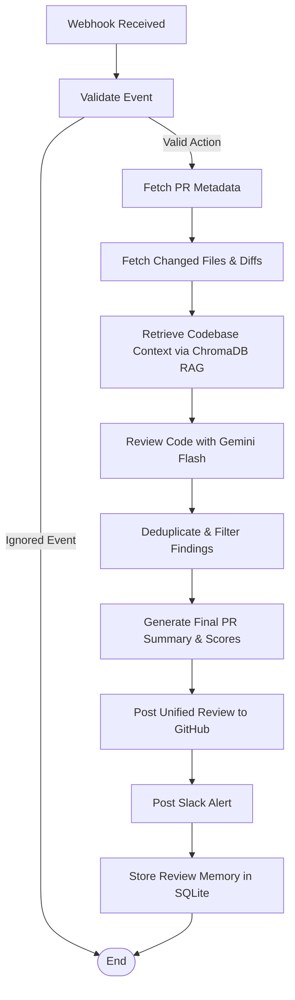

# 🤖 AI-Powered GitHub Pull Request Reviewer

A production-grade, agentic code review assistant built using **FastAPI**, **LangGraph**, **Google Gemini 2.5 Flash**, **ChromaDB (RAG)**, and **GitHub REST & Webhooks APIs**.

This system automatically reviews GitHub pull requests upon creation or updates, performing security, performance, maintainability, and coding standards validation. By utilizing Retrieval-Augmented Generation (RAG) over the existing repository codebase, it ensures that suggestions align with established codebase patterns and styles.

---

## 🏗️ Architecture & Data Flow

### Workflow Architecture
The system orchestrates review tasks using **LangGraph** as a state machine:



### Sequence Flow
Below is the system communication sequence:

```mermaid
sequenceDiagram
    autonumber
    actor Developer
    participant GitHub
    participant FastAPI App
    participant ChromaDB (RAG)
    participant Gemini API
    participant Slack

    Developer->>GitHub: Open / Update Pull Request
    GitHub->>FastAPI App: POST Webhook (Event: pull_request)
    Note over FastAPI App: Validates Signature & Schedules Background Review Task
    FastAPI App-->>GitHub: Response 200 OK (Accepted)
    
    rect rgb(30, 30, 40)
        Note over FastAPI App: Async Review Process (LangGraph)
        FastAPI App->>GitHub: Fetch PR metadata & changed file diffs
        GitHub-->>FastAPI App: Returns files, diff patches & metadata
        FastAPI App->>ChromaDB (RAG): Query similar code patterns in repository
        ChromaDB (RAG)-->>FastAPI App: Returns codebase references & conventions
        FastAPI App->>Gemini API: Run reviews with Structured JSON output
        Gemini API-->>FastAPI App: returns structured line-by-line issues
        FastAPI App->>Gemini API: Request PR summary review & scoring
        Gemini API-->>FastAPI App: returns markdown summary & scores
        FastAPI App->>GitHub: POST Review comments & summary block
        FastAPI App->>Slack: POST summary notification (Webhook)
        FastAPI App->>FastAPI App: Save run stats & feedback to SQLite database
    end
```



---

## 🌟 Advanced Features

1. **Structured AI Review Findings**: Enforces strict JSON return schema from Gemini to retrieve precise lines, issue categories, severity levels, and code recommendations.
2. **Repository-Aware RAG**: Indexes local repository files into ChromaDB vector collections. Queries conventions dynamically to compare new code against existing patterns (e.g., suggesting established loggers over `print`).
3. **Draft Review Batching**: Submits all inline comments and the overall summary as a single atomic GitHub Review, optimizing API usage and avoiding developer notification fatigue.
4. **Interactive Dashboard & Analytics**: A beautiful landing page serving system stats, setup configurations, and historical review data.
5. **Developer Feedback Loop Memory**: Subscribes to developer comments on reviews to record whether feedback was accepted, rejected, or disputed. Adapts future review filters accordingly.
6. **PR Risk Scoring**: Provides a 1-10 risk score estimating impact on production.
7. **Slack Webhook Notifications**: Sends rich block alerts detailing scores and issue summaries to Slack teams.

---

## ⚙️ Project Structure

```text
app/
├── api/
│   ├── webhooks.py         # Webhook receiver & signature validation
│   └── dashboard.py        # Analytics & indexing endpoints
├── config/
│   └── settings.py         # Config loading & schema verification
├── db/
│   └── session.py          # SQLAlchemy local session
├── github/
│   └── client.py           # Async HTTP Client for GitHub
├── models/
│   ├── database.py         # SQLite models (logs, findings, feedback)
│   └── schemas.py          # Pydantic webhook & response schemas
├── prompts/
│   ├── review_prompts.py   # File review prompts
│   └── summary_prompts.py  # Summary prompts
├── rag/
│   ├── indexer.py          # Code file chunking & database insertion
│   └── retriever.py        # Similarity search queries
├── services/
│   ├── analytics_service.py
│   ├── gemini_service.py
│   ├── github_service.py
│   └── slack_service.py
└── main.py                 # FastAPI application root & embedded landing page
tests/                      # Comprehensive pytest suites
```

---

## 🚀 Setup & Installation

### Prerequisites
- Python 3.12+
- Git
- Google Gemini API Key
- GitHub Personal Access Token (PAT) with `repo` scope

### 1. Local Setup
1. Clone the project and navigate to the folder:
   ```bash
   cd github-pr-reviewer
   ```
2. Create and activate a virtual environment:
   ```bash
   python -m venv venv
   # On Windows:
   venv\Scripts\activate
   # On Linux/macOS:
   source venv/bin/activate
   ```
3. Install dependencies:
   ```bash
   pip install -r requirements.txt
   ```
4. Create a `.env` file from the example:
   ```bash
   cp .env.example .env
   ```
5. Update `.env` variables with your credentials (API keys, GitHub tokens, webhook secret).

### 2. Running the Server Locally
Launch the FastAPI server with Uvicorn:
```bash
uvicorn app.main:app --reload --host 0.0.0.0 --port 8000
```
Visit `http://localhost:8000` to view the landing page and `http://localhost:8000/docs` for API Swagger docs.

### 3. Exposing Webhooks via Ngrok
To receive GitHub webhooks locally:
```bash
ngrok http 8000
```
Copy the forwarding HTTPS URL (e.g. `https://random-subdomain.ngrok-free.app`) and append `/api/v1/webhooks/github` as your payload URL in GitHub repository settings.

### 4. Indexing a Codebase for RAG
To initialize the RAG vector store for your repository:
```bash
curl -X POST "http://localhost:8000/api/v1/indexer/index" \
     -H "Content-Type: application/json" \
     -d '{"repo_name": "owner/repo", "local_path": "/path/to/local/repo"}'
```

---

## 🐳 Running with Docker

1. Build and launch containers:
   ```bash
   docker-compose up -d --build
   ```
2. The database and ChromaDB vector files will persist in the `./data` volume.

---

## 🧪 Running Tests
Run pytest to verify the entire system including unit tests, API tests, and Mock GitHub workflow loops:
```bash
pytest
```

---

## ☁️ Deployment Guide

### Render / Railway
1. Fork this repository.
2. Create a new **Web Service** on Render or Railway.
3. Configure the build command: `pip install -r requirements.txt` and start command: `uvicorn app.main:app --host 0.0.0.0 --port $PORT`.
4. Define the Environment Variables listed in `.env.example`.
5. Mount a persistent disk at `/app/data` to persist your SQLite database and ChromaDB vectors.

### AWS ECS / App Runner
1. Build the Docker image: `docker build -t github-pr-reviewer .`
2. Push to AWS ECR.
3. Create an AWS App Runner service pointing to ECR.
4. Add environment variables.
5. Alternatively, deploy on ECS using AWS Fargate with an EFS volume mounted at `/app/data` for persistence.
